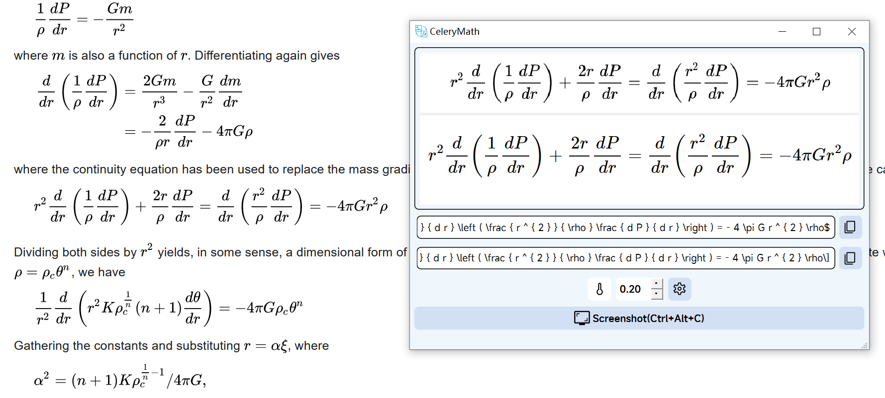

# Celery Math

Latex 公式识别

Another LaTex OCR Project

## 使用说明

1. 前往[Release](https://github.com/MODCT/CeleryMath/releases)下载最新版程序与模型。
2. 解压文件。
3. 将 `Tokenizer.json`、 `celeryMathEncoder.onnx`、 `celeryMathDecoder.onnx`  移动到 `conf` 文件夹内。
4. 打开 `celeryMath.exe`  配置路径。
5. 设置完成即可使用。

## 免责声明

本程序不保证识别结果的准确性，出现的错误可以提交Issue，使用者应该自行检查OCR结果。

## TODO

- [ ] API
- [x] Desktop Deploy
- [x] ONNX
- [ ] Compile to module
- [ ] Reduce package size
- [ ] Beam Search

## License

GPL-V3
[Read More](LICENSE)
